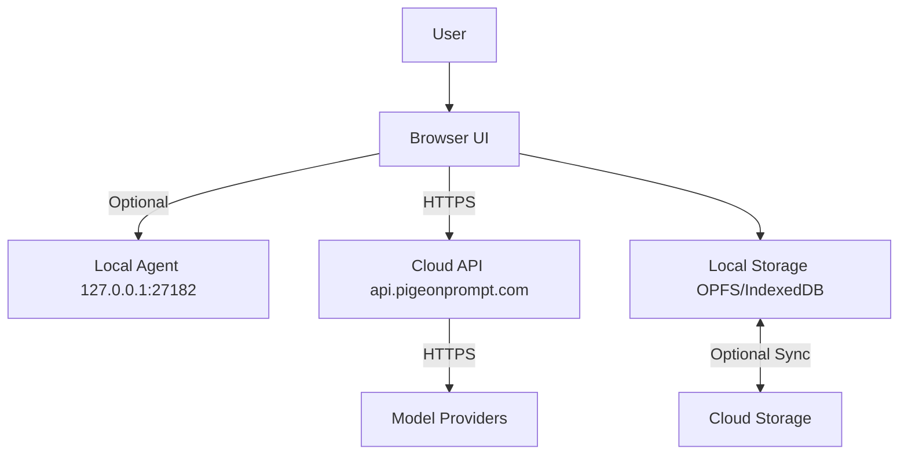

# Pigeon — Security Threat Model (v1)

Last updated: 2025-08-23
Scope: Web app (www.pigeonprompt.com), API (api.pigeonprompt.com), optional Local Agent (127.0.0.1:27182), model provider integrations (OpenAI, Anthropic, Google Gemini, Mistral, Ollama, DeepSeek).

1) Crown jewels (assets)
- User prompts, retrieved context, model outputs (confidentiality/integrity)
- API keys and provider credentials (secrecy)
- Local files selected for context (privacy)
- Prompt templates, history, and evaluations (IP)
- Team workspace data: shared templates, runs, analytics (integrity/access control)

2) Trust boundaries
- Browser UI ↔ Local Agent (loopback, explicit user consent)
- Browser UI ↔ Cloud API (TLS, auth)
- Cloud API ↔ Model Providers (TLS, per-provider auth)
- Local storage (OPFS/IndexedDB) ↔ Cloud sync (Phase 2+) (encryption and consent)

3) High-level data flows

4) Threats (STRIDE by flow)
- Spoofing
  - Phishing extension or site impersonation
  - Local agent port hijack via non-loopback binding
- Tampering
  - Malicious prompt/template altering via collab
  - Diff-apply altering unintended files
- Repudiation
  - Lack of audit logs for edits, runs, and admin actions
- Information disclosure
  - Unintended file inclusion bypassing ignore rules
  - Keys exposed via logs or browser storage
  - Prompt/context exfiltration via extensions
- Denial of service
  - Model/provider rate-limit exhaustion
  - Large repo indexing overload
- Elevation of privilege
  - CSRF on sensitive endpoints
  - Weak workspace role definitions

5) Mitigations (controls)
- Identity & Access
  - SSO/OAuth, short-lived tokens, per-session CSRF tokens, SameSite cookies
  - Role-based access for team workspaces; least-privilege defaults
- Secrets & Key Mgmt
  - WebCrypto: AES-GCM encrypt keys at rest; never log secrets; clipboard scrub
  - Per-provider scoping, optional key aliasing; support DEEPSEEK_API_KEY etc.
- Local Agent Safety
  - Bind 127.0.0.1 only, explicit user enablement, capability-based routing
  - Outbound network calls blocked by default; per-call consent
- Context & Files
  - Respect .gitignore and custom ignore; preflight “what leaves the machine”
  - Sandboxed workers for tokenization and language parsing
- Transport & Content Security
  - TLS 1.2+, HSTS, CSP default-src 'self'; subresource integrity for 3P scripts
- Observability & Forensics
  - Structured logs without PII; audit trails for edits/runs/shares; anomaly alerts
- DoS protections
  - Rate limits per-IP/user; job timeouts; size caps; backpressure and streaming

6) Abuse cases (examples)
- Malicious prompt template tricking users to include secrets; fix: content warnings, policy checks
- Collab spam creating noisy edits; fix: moderation queue and deflection tooling
- Prompt injection in retrieved files; fix: delimiters, system prompts, trusted context flags

7) Residual risks & roadmap
- Real-time collab introduces XSS/consistency risks → adopt CRDT (Yjs) with sanitization
- Cloud sync encryption key recovery UX → implement passphrase-based key wrapping + recovery codes
- Provider drift and model jailbreaks → continuous eval harness and safety filters

Appendix: Data classification
- Secret: API keys, encryption keys
- Sensitive: local files, prompts/outputs, team workspace content
- Internal: analytics, aggregated metrics